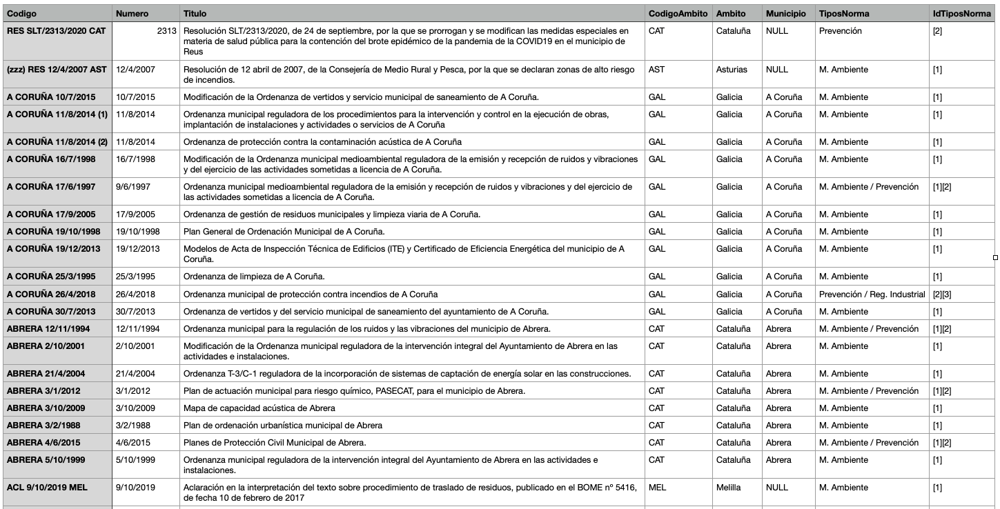
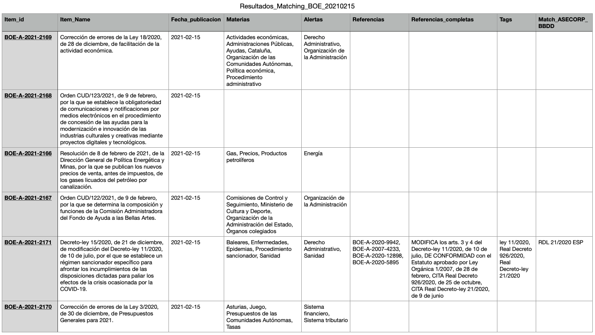
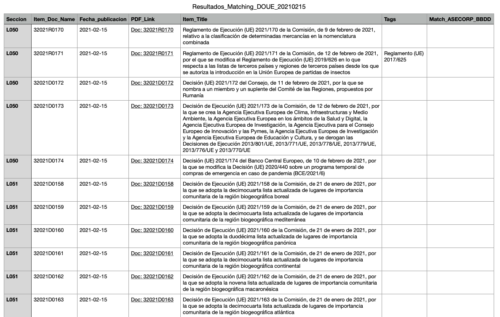
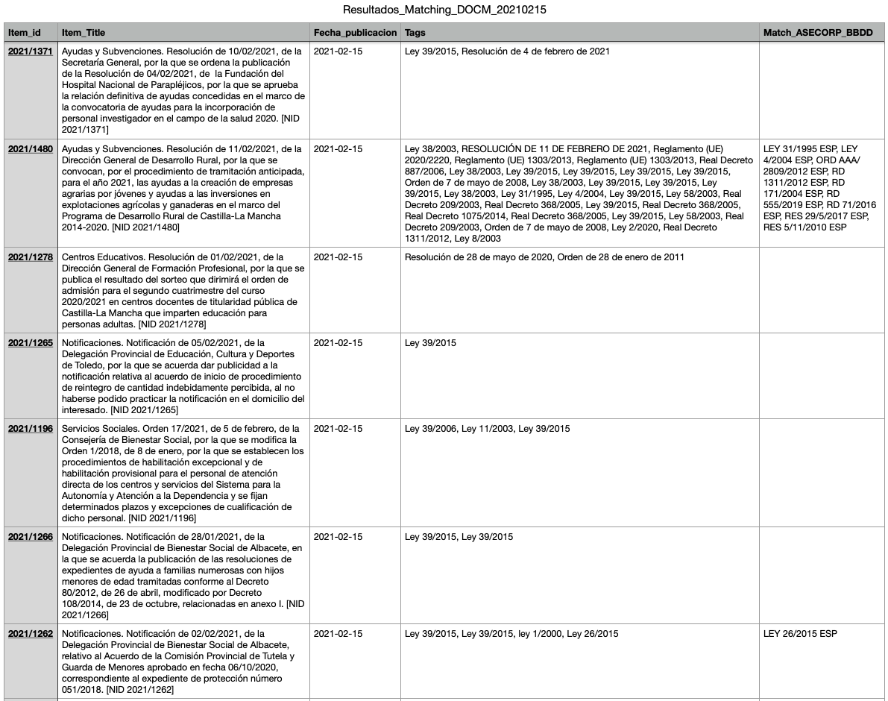

---
puppeteer:
    landscape: false
    format: "A4"
    timeout: 3000 # <= Special config, which means waitFor 3000 ms

    displayHeaderFooter: true

    #headerTemplate: 'Header 1'             
    
    footerTemplate: ' 
           _de_  
          
    '

    margin: {
        top: '100px',
        bottom: '100px',
        right: '30px',
        left: '30px',
    }
---

# Proyecto de Búsqueda de correspondencias entre BBDD ASECORP y Boletines Oficiales

## Descripción:

El proyecto considera la automatización de la búsqueda de coincidencias de normas, leyes, o disposiciones en general, de los distintos boletines autonómicos, nacionales y europeos que maneja ASECORP y que ya tiene catalogadas como de interés para su actividad, y que están recogidas en una BBDD que ASECORP gestiona, y de la cual nos entrega una versión reducida con información de interés (ver imagen).

En la primera fase del proyecto se busca la determinación de la viabilidad de la idea basada en los requerimientos previos expresados por ASECORP, en una pequeña pero significativa muestra de boletines:
* Basado en un primera evaluación del formato de entrega de los boletines, determinamos que hay 3 formatos que soportar:
    + XML
    + HTML
    + PDF
* En función de lo anterior, se eligen 3 boletines, en el que cada uno de ellos, y de manera respectiva, se corresponde con uno de esos tres formatos:
    + BOE
    + DOUE (Diario Oficial de la Unión Europea)
    + DOCM (Diario Oficial de Castilla la Mancha)

## Detalles de la implementación:

La implementación consisitirá en 3 pasos:
1. Extracción de información de la página web del diario correspondiente con frecuencia diaria. En función del formato de entrega de la información se utilizará el mecanismo adecuado de los 3 mencionados anteriormente.
2. Generación de los **TAGs** correspondientes a las normas, leyes o disposiciones mencionadas/referenciadas en cada una de las disposiciones recogidas, basado en el establecimiento de unas patrones a los que se ajusten los nombres de estas leyes o disposiciones. Como ejemplos de patrones de búsqueda podemos mencionar: Ley 11/2020, Real decreto 926/2020, Reglamento (UE) 2017/625, etc.
3. Búsqueda de coincidencias entre estos **TAGs** y los previamente generados en la **BBDD de ASECORP** 

Para que el algoritmo implementado funcione adecuadamente, hay una serie de prerrequisitos que deben observarse:
* En la **BBDD de ASECORP**, y en el campo que se utiliza como referencia de búsqueda de correspondencias: la columna con el nombre de ***Titulo***, debe estar libre de errores de entrada manual que impidan que se ajusten a estos patrones de búsqueda. Así, hemos detectado que en el caso del patrón: **Acuerdo Multilateral M-270**, existen registros que no incorporan el guión pero sí el espacio, y otros ni el guión ni el espacio. 

### BOE

Actualmente, y por motivos de simplicidad, sólo se considera la **Sección I. Disposiciones generales**, pero en fases posteriores se pueden incluír todas o parte de las secciones restantes del BOE. 

La Captura del BOE se realiza a través de un fichero XML, donde la información está estructurada y etiquetada de modo que es fácil capturar un gran nivel de detalle. De hecho, una de las particularidades es que ofrece, para cada disposición, un apartado de análisis en los que se encuentra información como:
* las materias a que se hace referencia
* Alertas sobre el tipo de disposición
* Y la más interesante para el proyecto que nos ocupa, son las  denominadas **Referencias Anteriores**, que no son más que el detalle a disposiciones anteriores referenciadas en la misma, y que podemos utilizar para realizar su búsqueda en la **BBDD de ASECORP**.

Considerando lo anterior, el algoritmo implementado entrega resultados del tipo que se puede ver en la siguiente imagen, y en la que en la columna **Match_ASECORP_BBDD** se menciona la disposición relacionada encontrada en la **BBDD de ASECORP**

### DOUE

Actualmente, y en esta fase del proyecto sólo hemos recogido las disposiciones relativas a la sección L (Legislación), obviando las correspondientes a la sección C (Comunicaciones e información).

Este boletín se entrega en formato HTML, y es así como lo recogemos y lo analizamos.

En este boletín se Tagea la columna **Item_Title**, y se compara con la **BBDD de ASECORP** para la búsqueda de coincidencias, que quedan reflejadas en la columna **Match_ASECORP_BBDD**, como puede verse en la captura de la tabla resultante

### DOCM (Diario Oficial de Castilla la Mancha)

Este boletín, es el más complejo de analizar con diferencia, y básicamente por dos razones:
1. La información no se puede extraer de manera convencional porque son páginas web que se sirven con un JS script, lo que complica su captura.
2. El formato de entrega de la información es un PDF, que de nuevo complica el acceso y manejo del detalle necesario para realizar el análisis.

En cualquier caso, gestionada la complejidad de la captura de la información, el análisis lo hemos realizado sobre todas las secciones disponibles en el boletín, y para una fase posterior del proyecto quizás se debería evaluar la posibilidad de eliminar algunas de ellas.

En la captura de la tabla resultante mostrada a continuación, se observa que las coincidencias, como en los boletines anteriores, se entrega en la columna **Match_ASECORP_BBDD**.

Un hecho importante a considerar, es que las correspondencias de un boletín se buscan frente a toda la **BBDD de ASECORP**, lo que puede dar lugar a coincidencias del tipo de las que vemos en esta tabla de resultados: Ley 31/1995 del boletín DOCM con LEY 31/1995 ESP de un boletín BOE, y que en su caso alguien debe decidir si son adecuadas, pero creemos preferible encontrar un **Falso positivo** a tener una **Omisión**.  

## Análisis de la BBDD de ASECORP

A continuación se presenta el ranking por Ámbito territorial de los registros incluídos en la BBDD. De la información resultante se observa que los boletines más interesantes para atacar al principio serían el DOGC, el BOE, y el DOUE respectivamente.

| Ambito             |   Registros |
|:-------------------|---------:|
| Cataluña           |     3588 |
| España             |     2959 |
| Europa             |     1890 |
| Valencia           |     1360 |
| Andalucía          |     1066 |
| Pais Vasco         |      819 |
| Aragón             |      803 |
| Castilla y Leon    |      777 |
| Galicia            |      744 |
| Madrid             |      720 |
| Canarias           |      638 |
| Castilla la Mancha |      574 |
| Baleares           |      573 |
| Murcia             |      486 |
| Navarra            |      464 |
| Rioja              |      428 |
| Asturias           |      395 |
| Cantabria          |      394 |
| Extremadura        |      346 |
| Ceuta              |       71 |
| Melilla            |       62 |